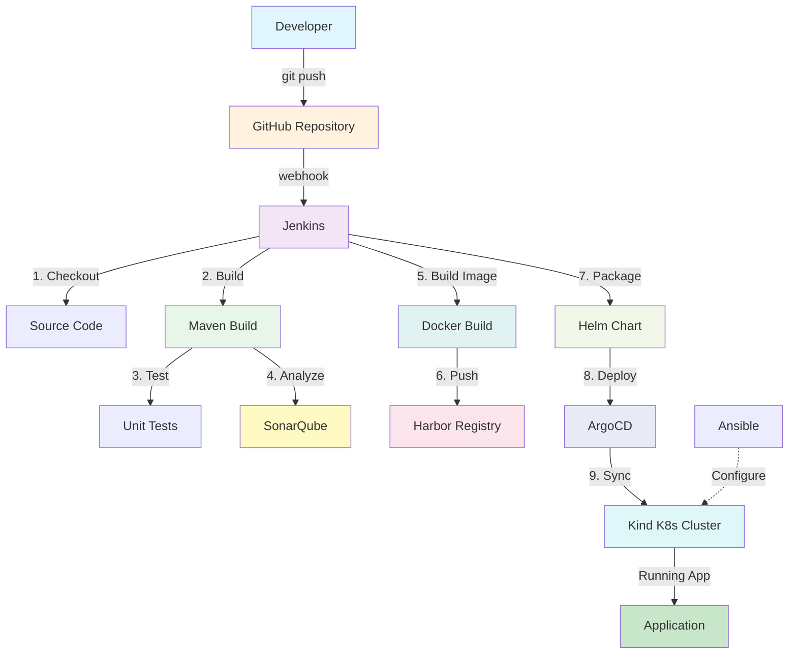
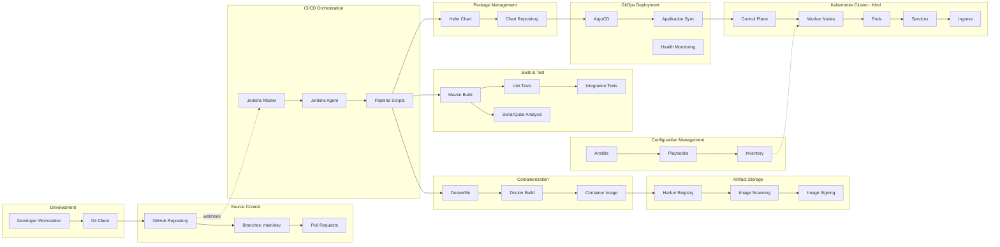
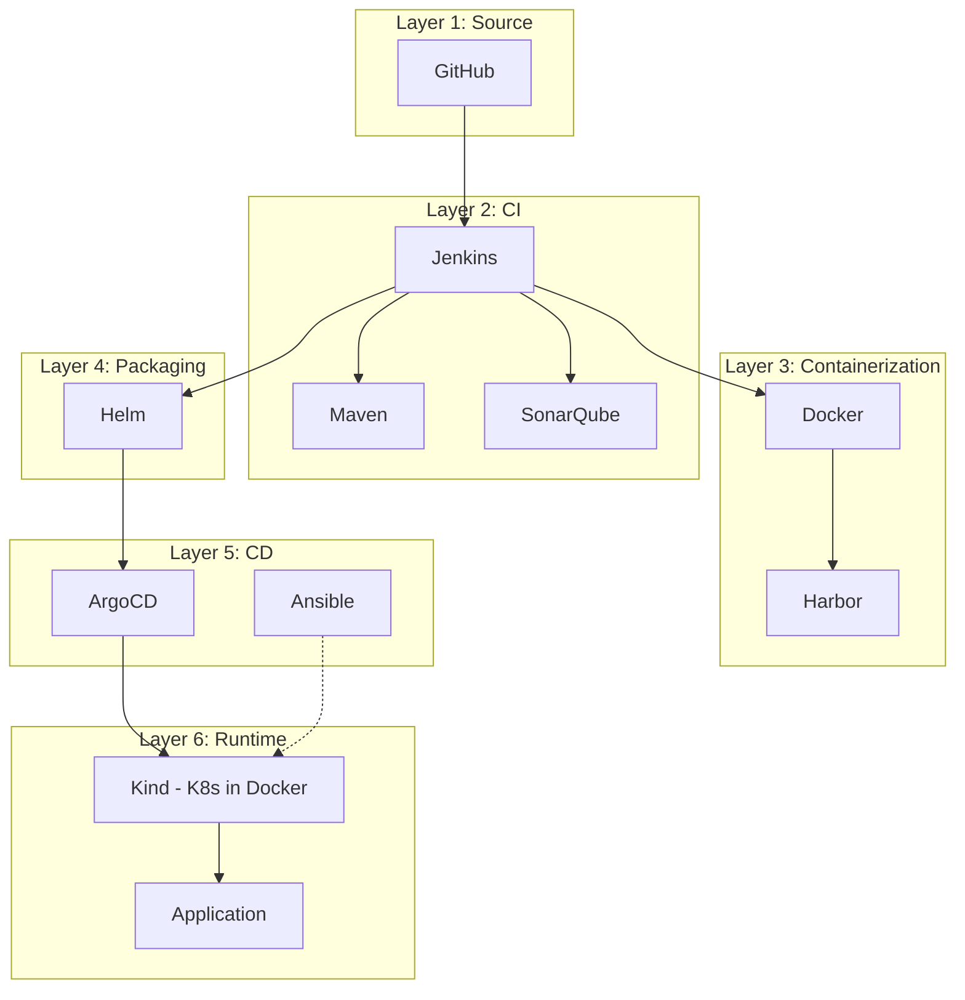
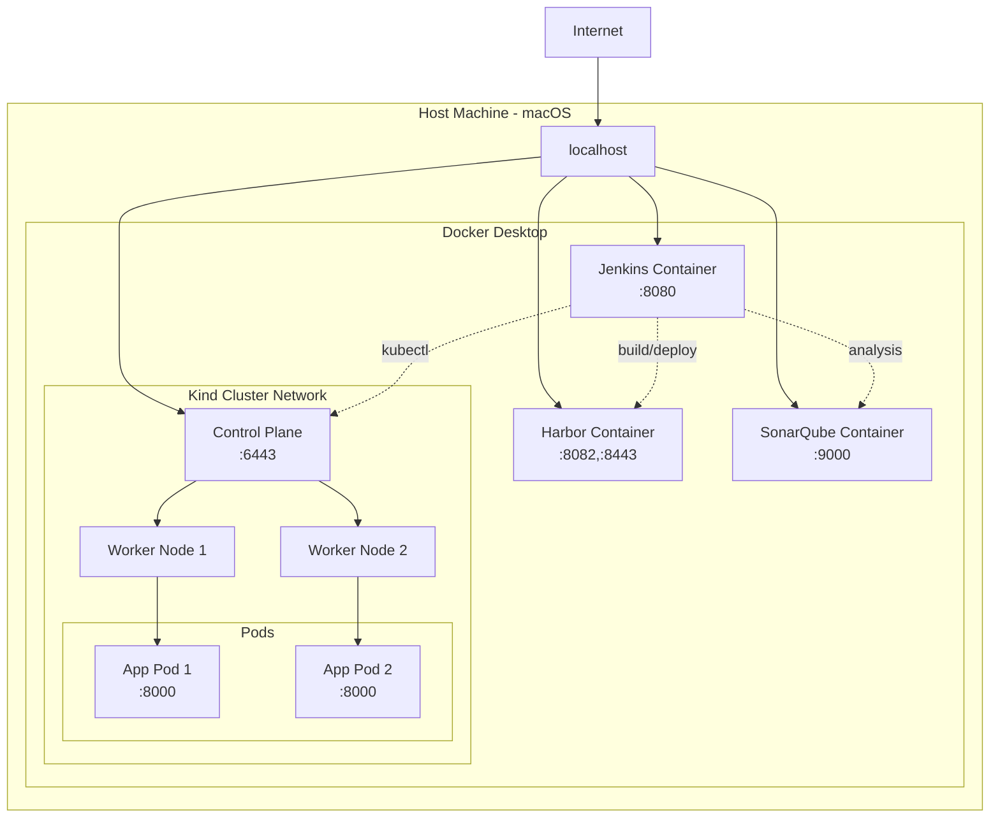
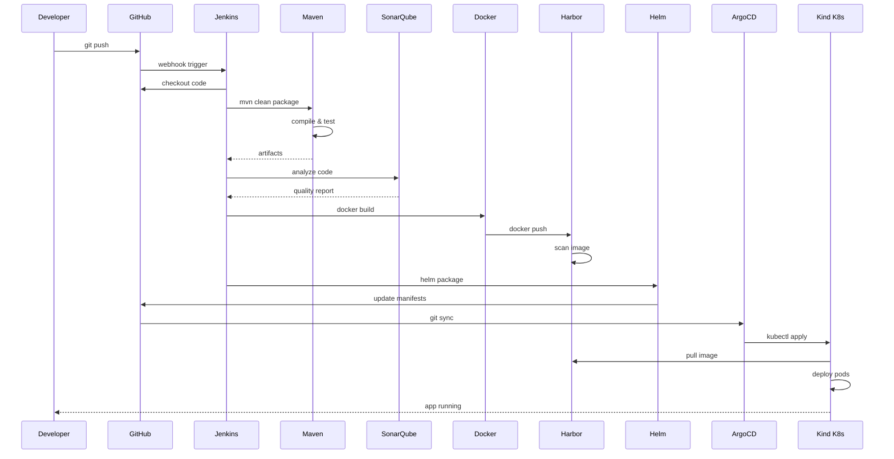
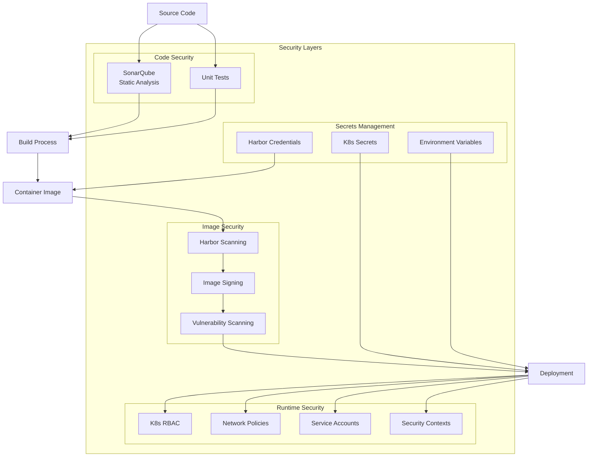
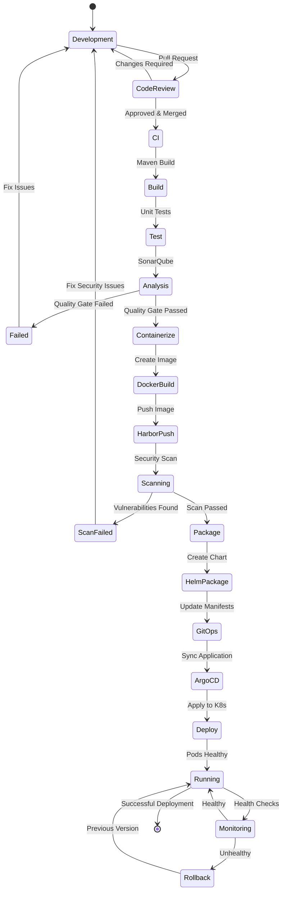
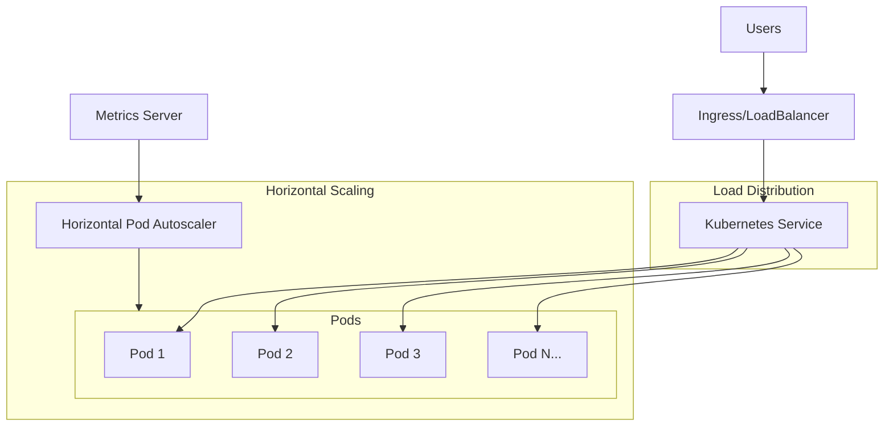
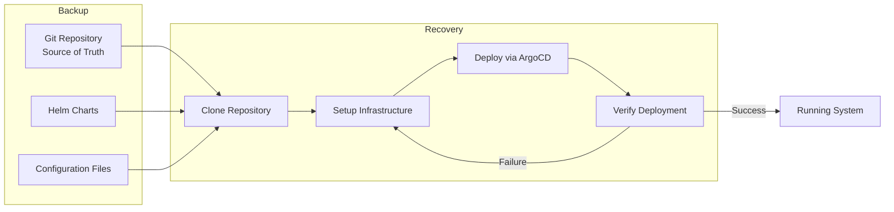

# CI/CD Pipeline Architecture

## Overview
This document provides a comprehensive view of the DevOps CI/CD pipeline architecture for the learning laboratory.

## Complete Pipeline Flow

## Detailed Architecture Diagram

## Component Interaction Matrix

## Network Architecture

## Data Flow Diagram

## Security Architecture

## Tool Integration Map

| Tool | Integrates With | Purpose |
|------|----------------|---------|
| **GitHub** | Jenkins, ArgoCD | Source control, manifest storage |
| **Jenkins** | Maven, SonarQube, Docker, Harbor, Helm, Kind | CI/CD orchestration |
| **Maven** | Jenkins, SonarQube | Build automation |
| **SonarQube** | Jenkins, Maven | Code quality analysis |
| **Docker** | Jenkins, Harbor, Kind | Container image creation |
| **Harbor** | Jenkins, Docker, Kind | Image registry and security |
| **Helm** | Jenkins, ArgoCD, Kind | Package management |
| **ArgoCD** | GitHub, Helm, Kind | GitOps deployment |
| **Kind** | kubectl, ArgoCD, Harbor | Kubernetes runtime |
| **Ansible** | Kind nodes | Configuration management |

## Deployment States

## Port Mappings Reference

| Service | Internal Port | External Port | Protocol | Access URL |
|---------|--------------|---------------|----------|------------|
| Jenkins | 8080 | 8080 | HTTP | http://localhost:8080 |
| Harbor | 80/443 | 8082/8443 | HTTP/HTTPS | http://localhost:8082 |
| SonarQube | 9000 | 8090 | HTTP | http://localhost:8090 |
| Application | 8000 | 8000 | HTTP | http://localhost:8000 |
| ArgoCD | 8080 | 8080 | HTTP | http://localhost:8080 |
| Kind API Server | 6443 | 6443 | HTTPS | https://localhost:6443 |

## Scaling Architecture

## Disaster Recovery Flow

## Summary

This architecture provides:
- **Automation**: Full CI/CD pipeline from code commit to deployment
- **Security**: Multiple scanning and validation layers
- **Scalability**: Kubernetes-based deployment with autoscaling
- **Reliability**: GitOps approach with rollback capabilities
- **Observability**: Health monitoring and metrics collection
- **Portability**: Container-based deployment on local Kind cluster
- **Best Practices**: Industry-standard tools and patterns

## Next Steps

1. Review the [Port Reference Guide](Port-Reference.md) for detailed port configurations
2. Follow the [Lab Setup Guide](#Lab-Setup-Guide.md) for implementation
3. Refer to [Troubleshooting Guide](Troubleshooting.md) for common issues
4. Check [Cleanup Guide](Cleanup-Guide.md) for environment teardown procedures
