# Kubelet Pod Deployment Process

## Overview
This document explains how the Kubelet component deploys and manages pods in a Kubernetes cluster. The Kubelet is the primary node agent that runs on each worker node and is responsible for managing pods and their containers.

## Kubelet Pod Deployment Architecture


## Detailed Pod Deployment Flow


## Kubelet Components and Responsibilities

```mermaid
graph LR
    subgraph "Kubelet Architecture"
        KL[Kubelet Main Process]

        subgraph "Managers"
            PM[Pod Manager]
            VM[Volume Manager]
            IM[Image Manager]
            SM[Status Manager]
            PM2[Probe Manager]
        end

        subgraph "Interfaces"
            CRI[Container Runtime<br/>Interface CRI]
            CNI[Container Network<br/>Interface CNI]
            CSI[Container Storage<br/>Interface CSI]
        end

        subgraph "Functions"
            SY[Pod Sync]
            HC[Health Checks]
            RM[Resource Monitoring]
            GC[Garbage Collection]
        end
    end

    KL --> PM
    KL --> VM
    KL --> IM
    KL --> SM
    KL --> PM2

    PM --> CRI
    VM --> CSI
    PM --> CNI

    PM --> SY
    PM2 --> HC
    SM --> RM
    IM --> GC

    style KL fill:#fff3e0
    style PM fill:#e8f5e9
    style CRI fill:#e3f2fd
    style CNI fill:#f3e5f5
    style CSI fill:#fce4ec
```



## Pod Lifecycle States


## Kubelet Pod Creation Steps


## Kubelet Watch and Sync Loop


## Container Runtime Interface (CRI) Operations


## Key Concepts

### 1. Pod Sandbox
The pod sandbox is the environment where containers run, including:
- **Network namespace**: Shared network stack for all containers
- **IPC namespace**: Inter-process communication
- **UTS namespace**: Hostname and domain name
- **Cgroups**: Resource limits and isolation

### 2. Kubelet Responsibilities
- **Pod Lifecycle Management**: Create, update, and delete pods
- **Container Health Monitoring**: Execute liveness and readiness probes
- **Resource Management**: Enforce CPU and memory limits
- **Volume Management**: Mount and unmount volumes
- **Image Management**: Pull images and garbage collect unused ones
- **Status Reporting**: Report pod and node status to API server

### 3. Pod Creation Phases

| Phase | Description | Kubelet Action |
|-------|-------------|----------------|
| **Pending** | Pod accepted but not running | Validate spec, pull images |
| **Running** | Pod bound to node, containers running | Monitor health, report status |
| **Succeeded** | All containers terminated successfully | Clean up resources |
| **Failed** | At least one container failed | Report failure, may restart |
| **Unknown** | Pod status cannot be determined | Attempt to reconnect |

### 4. Health Probes
- **Liveness Probe**: Determines if container is running; restarts on failure
- **Readiness Probe**: Determines if container is ready for traffic
- **Startup Probe**: Checks if application has started; delays other probes

### 5. Image Pull Policies
- **Always**: Always pull image from registry
- **IfNotPresent**: Pull only if image not present locally
- **Never**: Never pull, use local image only

## Kubelet Configuration

The Kubelet is configured with several important parameters:

```yaml
# Key Kubelet Configuration Options
--pod-manifest-path: Directory for static pod manifests
--sync-frequency: Sync frequency (default: 1m)
--pod-infra-container-image: Pause container image
--container-runtime-endpoint: CRI socket path
--max-pods: Maximum pods per node (default: 110)
--cluster-dns: DNS server for pods
--cluster-domain: Cluster domain (default: cluster.local)
```

## Troubleshooting Pod Deployment

### Common Issues and Resolution

1. **ImagePullBackOff**
   - Kubelet cannot pull container image
   - Check image name, registry credentials, network connectivity

2. **CrashLoopBackOff**
   - Container repeatedly crashes after starting
   - Check container logs, liveness probes, resource limits

3. **Pending State**
   - Pod stuck in Pending, not scheduled
   - Check node resources, taints/tolerations, affinity rules

4. **ContainerCreating**
   - Pod stuck creating containers
   - Check volume mounts, image pull status, CNI configuration

## Monitoring Kubelet Operations

```bash
# Check kubelet logs
journalctl -u kubelet -f

# View kubelet metrics
curl http://localhost:10255/metrics

# Check pod status
kubectl describe pod <pod-name>

# View kubelet configuration
kubectl get --raw /api/v1/nodes/<node-name>/proxy/configz
```

## References

- [Kubernetes Kubelet Documentation](https://kubernetes.io/docs/reference/command-line-tools-reference/kubelet/)
- [Container Runtime Interface (CRI)](https://kubernetes.io/docs/concepts/architecture/cri/)
- [Pod Lifecycle](https://kubernetes.io/docs/concepts/workloads/pods/pod-lifecycle/)
- [Node Components](https://kubernetes.io/docs/concepts/architecture/nodes/)
